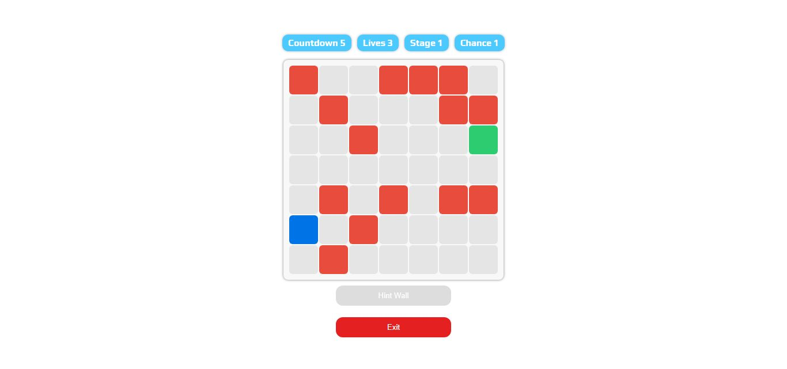
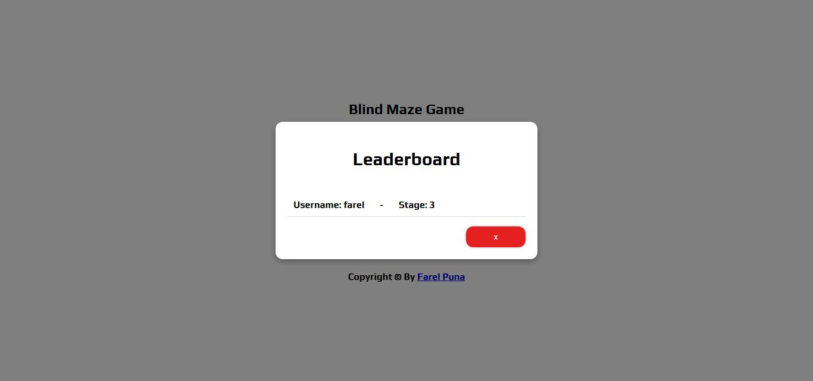

# Blind Maze Game
Game tantangan untuk menghafal posisi rintangan dan berhasil melewati jalur menuju titik finish tanpa menabrak.Game ini dibuat sebagai media latihan logika dan memori, serta untuk menguji ketepatan pemain dalam mengingat jalur rintangan dalam waktu singkat.

## 📌 Fitur & Tantangan

- ✅ Leaderboard Player.
- ✅ Responsive Tablet.
- ✅ Hindari Rintangan dan Temukan Titik Finish.
- ✅ Jaga Nyawa Selama Bermain.
- ✅ Capai Stage Tertinggi.

## 📷 Preview

## 🚀 Teknologi yang Digunakan

- [CSS]
- [JavaScript]
- Custom CSS

## 📁 Struktur Project

📄 index.html
📄 script.js
📄 style.css

## 📧 Contact

Jika ada pertanyaan atau masukan terkait project ini, kamu bisa menghubungi saya di:

**Email**: [farelpunn@gmail.com](mailto:farelpunn@gmail.com)

Atau kunjungi profil TikTok saya: [@puunnnpun](www.tiktok.com/puunnnpun)

